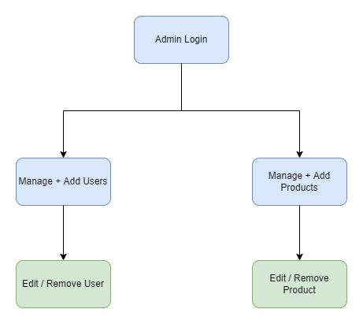
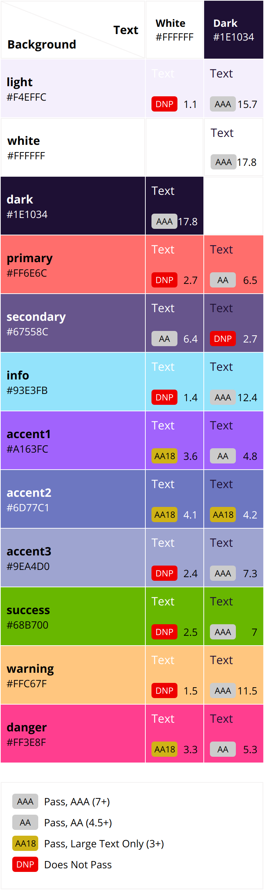

# Milestone 1

Página feita para resumir as demandas do Milestone 1.

## Protótipos

### Figma

<a href="https://www.figma.com/file/LzWsi7yFEvNQ4pdKTXLKaw/fluffshop?node-id=53%3A162" target="_blank">
Link para o projeto no Figma
</a>

### Navegação Figma

<a href="https://www.figma.com/proto/LzWsi7yFEvNQ4pdKTXLKaw/fluffshop?node-id=56%3A823&scaling=scale-down-width&page-id=0%3A1&starting-point-node-id=56%3A823" target="_blank">
Link para o protótipo com navegação completa no Figma
</a>

### HTML/CSS

<a href="https://opaulosoares.github.io/ecommerce-web-project/" target="_blank">
Protótipo em HTML + CSS
</a>

-   3 páginas feitas em HTML e CSS, como especificado.
    -   "Homepage", "Login" e "Foods"
-   Botões interativos nesse protótipo:
    -   "Sign In"
    -   "Foods"

## Diagramas de navegação

Diagrama de navegação do admin.

Uma versão simplificada do diagrama de navegação do site pode ser vista a seguir.

Além desta, também foi produzido um diagrama sendo uma versão mais detalhada da navegação, de maneira que pudesse ser visto o relacionamento entre as páginas com maior precisão.

## Tabela de Cores

Tabela de cores com seus respectivos testes de acessibilidade no padrao WCAG 2.0.

Nem todas cores devem passar nos testes, pois nem todas são usadas como texto ou fundo do texto. Contudo, as cores "dark" e "white" estão compatíveis entre si no padrão WCAG 2.0, o que é extrememamente relevante para a acessibilidade do site, visto que serão as cores mais usadas para o texto e fundo do texto. O nome e variações das cores restantes podem ser modificadas durante o progresso do projeto, porém as cores "dark" e "white" serão mantidas, além das cores oficiais da marca. Essa prática de refatoração é bastante comum em projetos como esse, pois o produto encontra-se em constante evolução.
